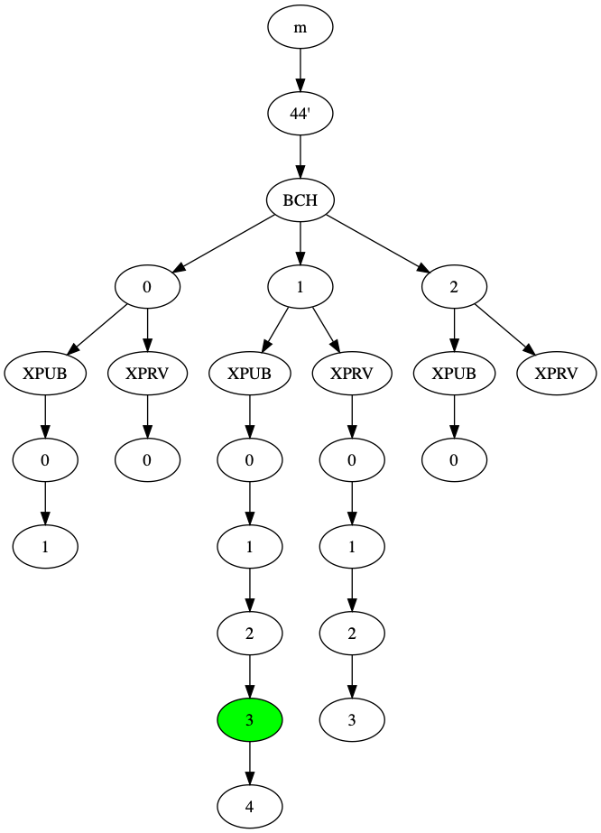

# Arcula
This repository contains a proof of concept implementation of Arcula, our design of Secure Hierarchical Deterministic Wallet released under the MIT license.

## Install
Arcula requires Python 3.7 or higher.

You can install Arcula from the Python Package Index as follows:
```bash
$ pip install --user arcula  # use "arcula[dev]" to install the optional development dependencies
$ python3 -c 'import arcula; print(arcula.__version__)'  # Test the installation
```
## Usage
Arcula can be either used as a command line executable or as a library.

### Command line usage
To be completed.

### Library usage
First, generate a seed. In our examples we use the [mnemonic package](https://github.com/trezor/python-mnemonic), that implements BIP39 to generate a seed.

```python
import mnemonic

m = mnemonic.Mnemonic(language='english').generate()
print(m)
seed = mnemonic.Mnemonic.to_seed(m)
```

Next, we define the structure of your hierarchy.
If you'd like to use the BIP44 standard, you can use our helper defined in `arcula.bip44`, e.g.:

```python
from arcula import bip44

WALLET_CONFIG = {
    'BCH': (
        # (n. of public, private addresses)
        (1, 2),
        (4, 5),
        (0, 1)
    )
}

w = bip44.ArculaBIP44(seed, WALLET_CONFIG)
```
This generates a wallet with the hierarchy of the image below.
The `ArculaBIP44` class provides the helper methods `get_cold_storage_public_key()` and `get_signing_key_certificate(path)` that respectively return the cold storage public key and the signing key and the authorization certificate of the node specified by `path` (e.g. `m/44'/BCH/1/xpub/3`).
Please refer to the Bitcoin Cash example below for detailed usages.

Otherwise, the `arcula.hierarchy.ArculaNode` class represents a node in a Arcula hierarchy and allows creating any custom hierarchy.
Every node is identified by a numeric `id` and an additional `tag`.
In addition, it holds a list `edges` of references to other nodes.

As an example, you can instantiate a custom binary hierarchy as follows:
```python
from arcula.hierarchy import ArculaNode

root = ArculaNode(id=0, tag='root')
left = ArculaNode(id=1, tag='l')
right = ArculaNode(id=1, tag='r')
root.edges = [left, right]
```

Next, run the key derivation process:
```python
from arcula import arcula

wallet = arcula.Arcula(root)
wallet.keygen()
```

The instances of `ArculaNode` hold their signing keys and their authorization certificates in the `certificate` and `_signing_key`attributes.
The `certificate` is a pair containing both the signature and the message signed.
E.g.:
```python
left.certificate, left._signing_key
```

## Examples

### Bitcoin Cash
The file [utils/bch_test.py](utils/bch_test.py) provides an example of how to use Arcula to send and receive funds on the Bitcoin Cash test network.

In our example, we fix the randomness of the seed generation to be `correct horse battery staple`, then we generate a BIP44 compatible wallet having the following structure:

<p align="center">
    
</p>

The node highlighted in green first received BCH from the testnet faucet, and then returned them back through the following transactions:
1. [337a67d36b8ecdd6bfbf2db654e54d71fcfd7a295cc97494e47272d305a6f444](https://explorer.bitcoin.com/tbch/tx/337a67d36b8ecdd6bfbf2db654e54d71fcfd7a295cc97494e47272d305a6f444)
2. [10594853b5dc6d482fc1abf24b68afde04ba71bbf7c780db4c98381064ded302](https://explorer.bitcoin.com/tbch/tx/10594853b5dc6d482fc1abf24b68afde04ba71bbf7c780db4c98381064ded302)

## Documentation
Most of the Arcula functions are heavily documented.
Our [academical paper](insert_link_of_academical_paper_here) describes our design insights, the formal definitions of Arcula and of the Deterministic Hierarchical Key Assignment key at its core, a detailed comparison with BIP32, and the formal security proofs.

## Authors
- Adriano Di Luzio, Sapienza University of Rome and Stevens Institute of Technology.
- Danilo Francati, Stevens Institute of Technology.
- Giuseppe Ateniese, Stevens Institute of Technology.
